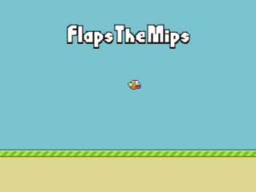

# Flaps The Mips

**Flaps The Mips** is a [Flappy Bird][FlappyBird] like game.

## Build this project

In order to compile this program you need **GNU toolchain** for MIPS. Once
installed change the path to **GCC** (variable `GCC_PREFIX` in `Makefile`).

This project use **GNU make**.  
You can use the following goals to build the project:

- `make dump` –  Compile the sources and dump the generated ELF file.

- `make copy` – Compile the sources and convert the generated ELF file into a
                binary file saved in **MIPSimu** `build` folder.

- `make run` – Same as `make copy` but run **MIPSimu** after.

- `make clean` – Delete generated `.o` and `.elf` files.

## License

This project is under the MIT license.  
Read the file called `LICENSE` at the root of the project for more information.

[FlappyBird]: https://en.wikipedia.org/wiki/Flappy_Bird
