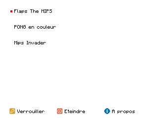

# Home menu

The program is an application launcher. It requires an additional memory of
32 Ko (use option `--r2` in **MIPSimu**).

## Build the home menu

In order to compile this program you need **GNU toolchain** for MIPS. Once
installed change the path to **GCC** in the variable `GCC_PREFIX` in the following
files:

- `Makefile`
- `scripts/objects/gas2obj.py`
- `scripts/objapp2obj.py`
- `scripts/memory/getobjsizes.py`

The program builder is written in Python 3 and require **Pillow** (install this
library with the following command: `python3 -m pip install Pillow`).

Also, this project use **GNU make**.  
You can use the following goals to build the project:

- `make dump` –  Compile the sources and dump the generated ELF file.
- `make copy` – Compile the sources and convert the generated ELF file into a
                binary file saved in **MIPSimu** `build` folder.
- `make run` – Same as `make copy` but run **MIPSimu** after.
- `make clean` – Delete generated `.o` and `.elf` files.

## Change applications in the menu

Information about applications in the menu are in `apps` folder. See the file
`README.md` in it for further details.

## License

This project is under the MIT license.  
Read the file called `LICENSE` at the root of the project for more information.
