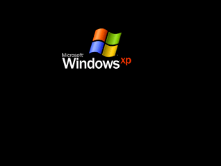

# ScreenSaver for MIPS




## Build this project

This project use **GNU make**.  
You can use the following goals to build the project:

- `make dump` –  Compile the sources and dump the generated ELF file.

- `make copy` – Compile the sources and convert the generated ELF file into a
                binary file saved in **MIPSimu** `build` folder.

- `make run` – Same as `make copy` but run **MIPSimu** after.

- `make clean` – Delete generated `.o` and `.elf` files.


## Change the screen saver image

You can change the screen saver image using `img2asm.py` script in the `images`
folder. Please note that this script requires **Pillow** (install this library
with the following command: `python3 -m pip install Pillow`).

In order to store the image in the RAM (only 8kB) the program uses a color
palette.  
There are 3 usual palette sizes:
- 256 colors (N=4 pixels per word)
- 64 colors (N=5 pixels per word)
- 32 colors (N=6 pixels per word)

You can specify the palette size with the `-p` argument. By default the palette
size is **64 colors**.  
Note: for technical reasons, the width of the input image must be a multiple of N.

You can specify a palette size between two usual values (73 colors for examples).
The number of pixels by word is rounded up to the N value of an usual palette
size.

For example, run the following command for using image called `windows-xp.png`
with 256 colors:
```sh
python3 img2asm.py windows-xp.png -p 256
```

I recommend using an image that has a width between 50px and 100px.


## License

This project is under the MIT license.  
Read the file called `LICENSE` at the root of the project for more information.
